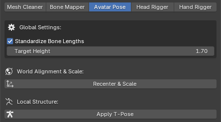

# Avatar Pose

Skeletal proportions and default poses are critical for standardizing character animation and Inverse Kinematics (IK) systems. This module ensures your avatar is mathematically symmetrical, perfectly grounded, and physically normalized before being exported to a game engine.

## Global Settings

* **Target Height:** Defines the exact real-world height (in meters) the avatar should have.
* **Standardize Bone Lengths:** When enabled, the toolkit calculates and equalizes the lengths of opposing limb pairs (e.g., perfectly matching the left arm's length to the right arm). This guarantees structural symmetry, preventing lopsided animations and uneven reach during IK solver evaluations.

## World Alignment & Scale

Game engines require avatars to spawn at the world origin facing a standard forward vector. If an avatar's origin is offset, root-motion animations and programmatic movement will behave erratically.

* **Recenter & Scale:** Clicking this button forces the toolkit to calculate the avatar's global orientation and align its forward axis to standard `-Y`. It then calculates the lowest foot bone to snap the character exactly to the floor plane (Z=0), centers the root strictly below the Head axis (X=0, Y=0), and scales the entire armature and meshes until the head reaches your defined `Target Height`.

## Local Structure

* **Apply T-Pose:** This final step purges unnecessary intermediate root bones (transferring their weights safely to the Hips), dynamically rotates the limbs into a strict geometric T-Pose relative to the avatar's internal coordinate system, and bakes this new posture as the definitive Rest Pose (BindPose). 
* **Why is a strict T-Pose necessary?** IK solvers and animation retargeting systems use the Rest Pose as their absolute zero-angle baseline to calculate limb bending. If an avatar is exported in an A-Pose or a relaxed stance, the game engine may misinterpret the baseline angles, resulting in perpetually bent knees, broken wrists, or collapsed shoulders when standard humanoid animations are applied.

