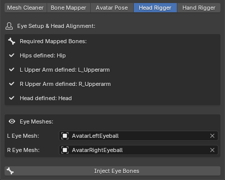

# Head Rigger

The **Head Rigger** module automates the intricate process of setting up eye bones and ensuring the avatar's gaze is perfectly leveled. Dedicated eye bones are essential for facial animation, look-at IK constraints, and gaze-tracking features in game engines.

## Eye Setup & Head Alignment

Before injecting the bones, the module verifies that specific skeletal landmarks are mapped:

*   **Required Mapped Bones:** The toolkit strictly requires the Hips, Head, and both Upper Arms to be mapped. The underlying algorithm uses these specific bones to calculate the avatar's true orthogonal forward and upward directions, ensuring the eyes point exactly forward regardless of the original rig's spatial orientation.

## Eye Meshes

*   **Auto-Detection:** The toolkit automatically scans your linked meshes and attempts to assign the left and right eyes based on standard naming conventions (e.g., 'lefteye', 'r_eye'). 
*   **Manual Assignment:** If your meshes use unconventional names, you can manually select the correct meshes for the `L Eye Mesh` and `R Eye Mesh` fields.

## The Injection Process

Clicking the **Inject Eye Bones** button triggers a multi-step programmatic sequence:

*   **Center Calculation & Injection:** The module evaluates the bounding box of the assigned eye meshes to find their exact geometric 3D centers. It then creates new `L_Eye` and `R_Eye` bones at these coordinates, parents them to the Head bone, and aligns their roll to the avatar's upward axis.
*   **Smart Proportion Fallback:** If no eye meshes are provided, the algorithm analyzes the geometric bounds of the main head's vertex group to mathematically estimate the eye positions using human facial proportions (placing them dynamically at 55% height and 85% forward depth relative to the skull).
*   **Automated Weight Binding:** The target eye meshes are automatically weighted with a `1.0` influence to the new eye bones. Crucially, the toolkit removes these vertices from the main Head vertex group to prevent double-transform distortion during animation.
*   **Horizontal Head Alignment:** Finally, the tool calculates the vector between the two calculated eye centers. It automatically twists the main Head bone to ensure this axis is completely parallel to the ground (Z=0 relative difference), guaranteeing a leveled, non-tilted gaze in-engine.

