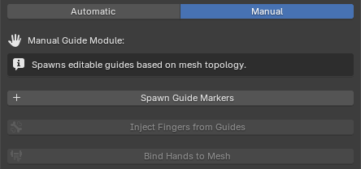

# Hand Rigger

Fingers are traditionally the most tedious and error-prone area of character setup. The **Hand Rigger** module eliminates this bottleneck using advanced topological and volumetric algorithms to perfectly align and weight finger bones in seconds.

## Required Mapped Bones
Before generating fingers, the toolkit strictly requires the Left and Right Lower Arms (Forearms), as well as the Left and Right Hands to be mapped. The engine uses these bones as baseline vectors to determine the accurate forward and upward orientations of the hands.

There are two ways for generating the bones: **Automatic Mode (recommended)**, or **Manual Mode**. 

## Automatic Mode (Volumetric Medial Axis Engine)
This is the recommended workflow for most standard characters.

*   **How it works:** Clicking **Auto-Rig Voxel Hands** temporarily converts the hand meshes into a dense 3D voxel grid using OpenVDB. The module then utilizes SciPy's graph pathfinding to calculate the true internal "Medial Axis" (the absolute geometric center) of each finger volume. This guarantees that bones are placed perfectly in the center of the geometry, regardless of the finger's thickness or curvature.
*   **Voxel Resolution:** This parameter dictates the density of the calculation grid. Lower values (e.g., `0.0020`) yield highly accurate medial paths but require exponentially more CPU processing time to calculate the graphs.
*   **Anatomical Joints:** Once the paths are found, the algorithm smooths them and automatically calculates the exact positions of the MCP, PIP, and DIP joints based on strict human anatomical knuckle ratios.

> **Performance Warning:** Generating volumetric bones is a computationally heavy process. Depending on the geometric complexity of your avatar and the chosen Voxel Resolution, this operation can take anywhere from a few seconds to several minutes. During this time, the Blender interface will freeze and become completely unresponsive. This is a normal, blocking operation—please wait for it to finish.

## Manual Mode (Smart Guides)
Automatic voxelization might struggle with highly stylized geometry, heavily merged low-poly assets, or hands wearing thick gloves. Manual mode bridges this gap by offering a hybrid approach.

*   **Spawn Guide Markers:** Clicking this button runs a topological flood-fill and slicing algorithm to detect the fingertips. It spawns a single, straight guide bone for each detected finger. You can quickly adjust the root and tip of these 5 guides in Blender's Edit Mode.
*   **Inject Fingers from Guides:** Once your guides are correctly placed, this operator replaces them with a complete, production-ready 4-bone hierarchy per finger (proximal, intermediate, distal, tip), automatically aligning their local roll axes to bend correctly.

## Binding & Smart Culling
Once the finger bones are generated via either mode, clicking **Bind Hands to Mesh** applies automatic weights.

*   **Smart Back-of-Hand Culling:** Standard automatic weighting in 3D software often incorrectly assigns finger influence to the back of the hand, causing the knuckles to collapse unnaturally when the character makes a fist. To fix this, the module runs a geometric dot-product filter. It analyzes all vertices located strictly behind the knuckle joints, strips their finger weights, and seamlessly transfers that influence back to the main Hand bone to preserve rigid knuckle structure.

