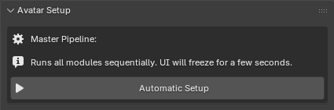
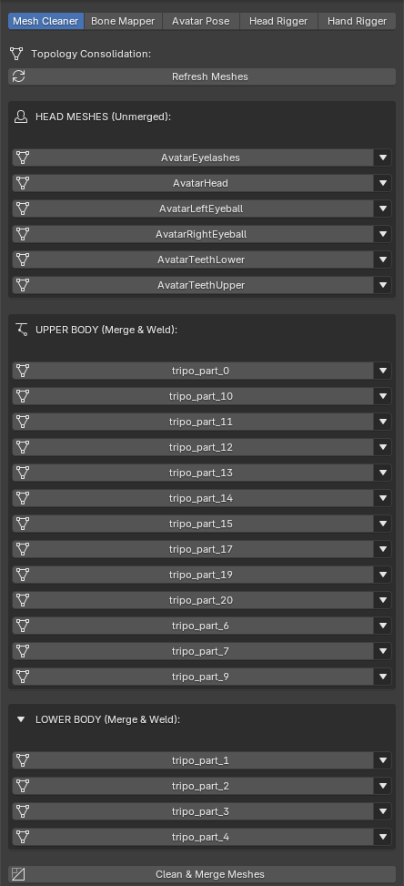
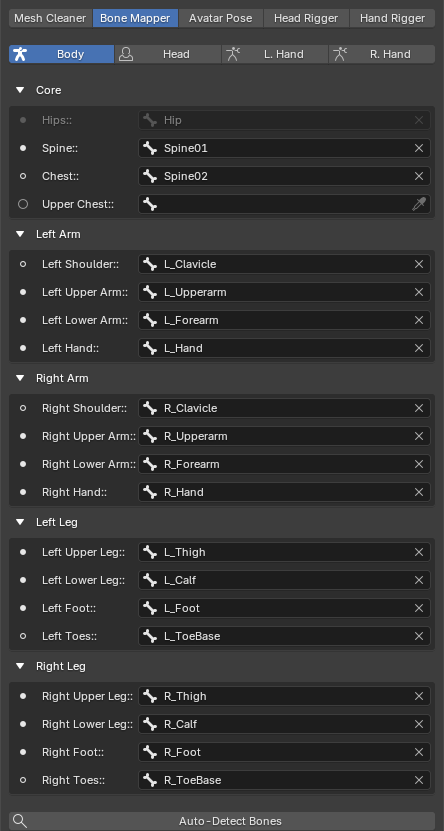
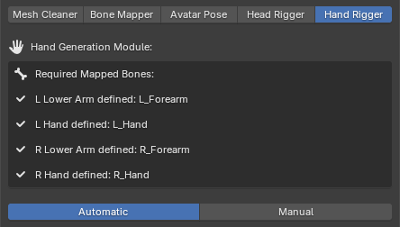
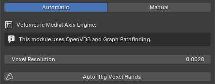

# Avatar Setup

The **Avatar Setup** module is the foundational step of the QXR pipeline. It standardizes incoming 3D character models by normalizing dimensions, correcting skeletal postures, and preparing the rig for full-body tracking and IK compatibility. 

This module can be executed either fully automatically or step-by-step through its specific submodules.

---

## Master Pipeline (Automatic Setup)

The **Master Pipeline** is designed for maximum efficiency and mirrors the exact behavior of our headless Cloud Service. 

By clicking **Automatic Setup**, the toolkit sequentially executes all the individual submodules (Mesh Cleaner, Bone Mapper, Pose, Head, and Hand Rigger) using their default, production-tested parameters. 

> **Performance Note:** Because this process chains multiple complex algorithms (including topological mapping and volumetric voxel analysis) the Blender UI will freeze for a few seconds. This is completely normal behavior.

---

## Manual Submodules

If your asset requires specific tweaks or fails the automatic process due to an unconventional rig structure, you can run and configure each step manually using the module tabs.

### 1. Mesh Cleaner

Before any skeletal work begins, the mesh data must be clean and properly linked to the armature. Often, imported avatars come with scattered geometry, unapplied transforms, or separated body parts that unnecessarily increase rendering draw calls.

The **Mesh Cleaner** module analyzes all meshes driven by the active skeleton, cleans their topology, and organizes them into specific functional categories:

* **HEAD MESHES (Unmerged):** This category is reserved for facial geometry, including the main head, eyes, teeth, and eyelashes. **Crucial:** Meshes placed in this category are explicitly *ignored* during the merge process. This isolation guarantees that any existing facial Blendshapes (Shape Keys)—which are essential for lip-syncing, eye tracking, and expressions—are perfectly preserved.
* **UPPER & LOWER BODY (Merge & Weld):** These categories hold the structural parts of the character, such as the torso, limbs, and clothing. To maximize real-time engine performance, the pipeline will permanently merge these meshes together and automatically weld any disconnected vertices along their seams.

**Managing Mesh Categories:**

Upon clicking **Refresh Meshes**, the toolkit attempts to auto-assign categories based on mesh nomenclature and spatial positioning. 

* **Identify:** Each mesh name in the list functions as a clickable button. Clicking it will select the corresponding mesh directly in the Blender 3D Viewport, allowing you to quickly identify it and verify its assignment.
* **Reassign:** If a mesh is in the wrong category, click the **down arrow (▼)** located on its right side to open the quick-assign menu, and select its correct target group (Head, Upper Body, or Lower Body).

Once you are confident that every mesh is placed in its correct category, click the **Clean & Merge Meshes** button at the bottom of the panel to execute the consolidation process.

### 2. Bone Mapper

Characters downloaded from different sources or 3D marketplaces rarely share the same bone naming conventions. The **Bone Mapper** acts as a translation layer, identifying the specific bones in your imported armature and mapping them to the standardized internal QXR nomenclature. 

To make navigation intuitive, the interface groups the skeletal hierarchy into four main tabs, directly inspired by Unity’s Humanoid mapping system: **Body, Head, L. Hand,** and **R. Hand**.

**Mapping Workflow:**

1. **Auto-Detect Bones:** Start by clicking the `Auto-Detect` button (magnifying glass icon) at the bottom of the panel. The toolkit will run a heuristic scan based on naming conventions to intelligently find and assign as many empty slots as possible.
2. **Manual Assignment:** If the auto-detection misses a bone due to a highly unconventional naming scheme, you can easily map it yourself by clicking the search field next to any unassigned bone and selecting the correct bone from the dropdown list.

**Bone Status Indicators:**

The UI provides immediate visual feedback on the state of your skeletal mapping through specific icons next to each bone field:

* **⚠️ Warning Icon:** Indicates a **mandatory** bone that is currently **unassigned**. All mandatory bones must be mapped before you can proceed to the Avatar Pose or subsequent rigging phases.
* **⚪ Filled Circle:** Indicates a **mandatory** bone that has been **successfully assigned**.
* **⚫ Empty Circle:** Indicates an **optional** bone (e.g., Upper Chest, Jaw). It remains an empty circle whether it is assigned or left empty. While mapping them provides higher animation fidelity, the pipeline will safely adapt and function without them.

**Special Case: Topological Hips Resolution**

You will notice that the **Hips** bone field is disabled and cannot be assigned manually. Instead, the toolkit calculates its exact position dynamically. 

Once the Spine, Left Upper Leg, and Right Upper Leg bones are mapped, the core mapper algorithm executes a topological resolution. It traverses upwards through the hierarchical parent paths of these three bones to find their intersection. The first common ancestor bone shared by the spine and both legs is automatically locked in as the true Hips.

### 3. Avatar Pose

Skeletal proportions and default poses are critical for standardizing character animation and Inverse Kinematics (IK) systems. This module ensures your avatar is mathematically symmetrical, perfectly grounded, and physically normalized before being exported to a game engine.

**Global Settings:**

* **Target Height:** Defines the exact real-world height (in meters) the avatar should have.
* **Standardize Bone Lengths:** When enabled, the toolkit calculates and equalizes the lengths of opposing limb pairs (e.g., perfectly matching the left arm's length to the right arm). This guarantees structural symmetry, preventing lopsided animations and uneven reach during IK solver evaluations.

**World Alignment & Scale:**

Game engines require avatars to spawn at the world origin facing a standard forward vector. If an avatar's origin is offset, root-motion animations and programmatic movement will behave erratically.

* **Recenter & Scale:** Clicking this button forces the toolkit to calculate the avatar's global orientation and align its forward axis to standard `-Y`. It then calculates the lowest foot bone to snap the character exactly to the floor plane (Z=0), centers the root strictly below the Head axis (X=0, Y=0), and scales the entire armature and meshes until the head reaches your defined `Target Height`.

**Local Structure:**

* **Apply T-Pose:** This final step purges unnecessary intermediate root bones (transferring their weights safely to the Hips), dynamically rotates the limbs into a strict geometric T-Pose relative to the avatar's internal coordinate system, and bakes this new posture as the definitive Rest Pose (BindPose). 
* **Why is a strict T-Pose necessary?** IK solvers and animation retargeting systems use the Rest Pose as their absolute zero-angle baseline to calculate limb bending. If an avatar is exported in an A-Pose or a relaxed stance, the game engine may misinterpret the baseline angles, resulting in perpetually bent knees, broken wrists, or collapsed shoulders when standard humanoid animations are applied.

### 4. Head Rigger

The **Head Rigger** module automates the intricate process of setting up eye bones and ensuring the avatar's gaze is perfectly leveled. Dedicated eye bones are essential for facial animation, look-at IK constraints, and gaze-tracking features in game engines.

**Eye Setup & Head Alignment:**

Before injecting the bones, the module verifies that specific skeletal landmarks are mapped:

*   **Required Mapped Bones:** The toolkit strictly requires the Hips, Head, and both Upper Arms to be mapped. The underlying algorithm uses these specific bones to calculate the avatar's true orthogonal forward and upward directions, ensuring the eyes point exactly forward regardless of the original rig's spatial orientation.

**Eye Meshes:**

*   **Auto-Detection:** The toolkit automatically scans your linked meshes and attempts to assign the left and right eyes based on standard naming conventions (e.g., 'lefteye', 'r_eye'). 
*   **Manual Assignment:** If your meshes use unconventional names, you can manually select the correct meshes for the `L Eye Mesh` and `R Eye Mesh` fields.

**The Injection Process:**

Clicking the **Inject Eye Bones** button triggers a multi-step programmatic sequence:

*   **Center Calculation & Injection:** The module evaluates the bounding box of the assigned eye meshes to find their exact geometric 3D centers. It then creates new `L_Eye` and `R_Eye` bones at these coordinates, parents them to the Head bone, and aligns their roll to the avatar's upward axis.
*   **Smart Proportion Fallback:** If no eye meshes are provided, the algorithm analyzes the geometric bounds of the main head's vertex group to mathematically estimate the eye positions using human facial proportions (placing them dynamically at 55% height and 85% forward depth relative to the skull).
*   **Automated Weight Binding:** The target eye meshes are automatically weighted with a `1.0` influence to the new eye bones. Crucially, the toolkit removes these vertices from the main Head vertex group to prevent double-transform distortion during animation.
*   **Horizontal Head Alignment:** Finally, the tool calculates the vector between the two calculated eye centers. It automatically twists the main Head bone to ensure this axis is completely parallel to the ground (Z=0 relative difference), guaranteeing a leveled, non-tilted gaze in-engine.

### 5. Hand Rigger

Fingers are traditionally the most tedious and error-prone area of character setup. The **Hand Rigger** module eliminates this bottleneck using advanced topological and volumetric algorithms to perfectly align and weight finger bones in seconds.

**Required Mapped Bones:**
Before generating fingers, the toolkit strictly requires the Left and Right Lower Arms (Forearms), as well as the Left and Right Hands to be mapped[cite: 14]. The engine uses these bones as baseline vectors to determine the accurate forward and upward orientations of the hands[cite: 13, 14].

There are two ways for generating the bones: **Automatic Mode (recommended)**, or **Manual Mode**. Once the finger bones are generated via either mode, clicking **Bind Hands to Mesh** applies automatic weights[cite: 13].

**Automatic Mode (Volumetric Medial Axis Engine):**
This is the recommended workflow for most standard characters.

*   **How it works:** Clicking **Auto-Rig Voxel Hands** temporarily converts the hand meshes into a dense 3D voxel grid using OpenVDB[cite: 13]. The module then utilizes SciPy's graph pathfinding to calculate the true internal "Medial Axis" (the absolute geometric center) of each finger volume[cite: 13]. This guarantees that bones are placed perfectly in the center of the geometry, regardless of the finger's thickness or curvature[cite: 13].
*   **Voxel Resolution:** This parameter dictates the density of the calculation grid. Lower values (e.g., `0.0020`) yield highly accurate medial paths but require exponentially more CPU processing time to calculate the graphs.
*   **Anatomical Joints:** Once the paths are found, the algorithm smooths them and automatically calculates the exact positions of the MCP, PIP, and DIP joints based on strict human anatomical knuckle ratios[cite: 13].

**Manual Mode (Smart Guides):**
Automatic voxelization might struggle with highly stylized geometry, heavily merged low-poly assets, or hands wearing thick gloves. Manual mode bridges this gap by offering a hybrid approach.

*   **Spawn Guide Markers:** Clicking this button runs a topological flood-fill and slicing algorithm to detect the fingertips[cite: 13]. It spawns a single, straight guide bone for each detected finger[cite: 13, 14]. You can quickly adjust the root and tip of these 5 guides in Blender's Edit Mode.
*   **Inject Fingers from Guides:** Once your guides are correctly placed, this operator replaces them with a complete, production-ready 4-bone hierarchy per finger (proximal, intermediate, distal, tip), automatically aligning their local roll axes to bend correctly[cite: 13].

*   **Smart Back-of-Hand Culling:** Standard automatic weighting in 3D software often incorrectly assigns finger influence to the back of the hand, causing the knuckles to collapse unnaturally when the character makes a fist. To fix this, the module runs a geometric dot-product filter[cite: 13]. It analyzes all vertices located strictly behind the knuckle joints, strips their finger weights, and seamlessly transfers that influence back to the main Hand bone to preserve rigid knuckle structure[cite: 13].

