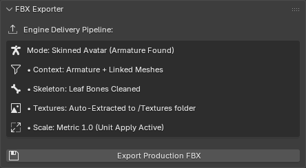

# FBX Exporter

The **FBX Exporter** is the final step in the QXR Asset Toolkit pipeline. Its primary function is to guarantee that the optimized avatar is perfectly packaged and correctly formatted for immediate use in real-time game engines like Unity and Unreal Engine.

## Core Features

Exporting directly from Blender can often result in bloated file sizes or broken rig orientations. This module automates the necessary fixes before export:

* **Unit Scale Correction:** Adjusts the internal metric scaling so the avatar imports seamlessly into engines without requiring an artificial scale factor.
* **Automatic Texture Extraction:** Instead of embedding textures inside the FBX, the toolkit intelligently unpacks and saves all generated materials into an adjacent `Textures` folder for a cleaner engine import.
* **Name Sanitization:** Automatically cleans up any duplicated `.001` suffixes from Blender's memory before exporting, ensuring clean material and texture names.
* **Clean Skeleton:** Prevents the generation of unnecessary leaf bones, keeping the skeletal hierarchy clean and engine-ready.

## Interface & Controls

The **FBX Exporter Panel** provides a streamlined, one-click solution that adapts to your scene:

* **Engine Delivery Pipeline:** Displays real-time context about the export, such as whether it detected a "Skinned Avatar" or a "Static Prop". It also confirms the texture extraction folder and scale settings.
* **Export Production FBX Button:** Triggers a standard file dialogue to define the output directory. The script will generate the `.fbx` file and its companion `Textures` folder in this exact location.

## Recommended Workflow

1. Ensure you have run the **Avatar Setup** and **Mesh LOD** modules.
2. Open the **FBX Exporter** panel in the QXR tab.
3. Verify the Engine Delivery Pipeline information on the screen.
4. Click **Export Production FBX** and choose your destination folder. 

Your avatar and its linked `Textures` folder are now ready to be dragged and dropped directly into your Unity or Unreal Engine project!