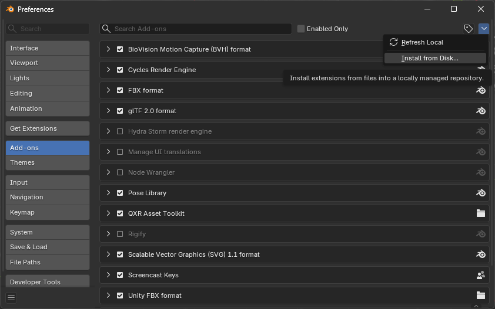
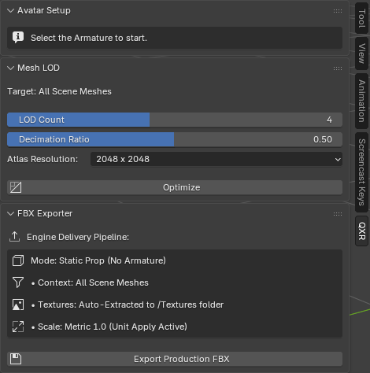

# Blender Add-on

The QXR Asset Toolkit can be installed directly into Blender as a standard add-on. This provides a native graphical interface to run the optimization pipeline locally on your machine, giving you real-time visual feedback over the avatar generation process.

## Installation

To install the add-on, follow these standard Blender procedures:

1. Download the latest `qxr_asset_toolkit.zip` release file.
2. Open Blender and navigate to **Edit > Preferences > Add-ons**.
3. Click the down-arrow icon in the top right corner of the window, select **Install from Disk...** (as shown in the image below), and locate your downloaded `.zip` file.
4. Once installed, check the box next to **QXR Asset Toolkit** to enable the add-on.

> **Compatibility Note:** The QXR Asset Toolkit has been actively developed and tested on **Blender 5.1**. While it might execute on older versions, backwards compatibility is not officially supported or guaranteed.

## User Interface

Once enabled, the toolkit integrates seamlessly into Blender's 3D Viewport. 

To access it, simply press the `N` key while hovering over the 3D Viewport to open the side panel, and click on the new **QXR** tab.

The interface is cleanly divided into collapsible panels matching our core modules:

* **[Avatar Setup Panel](avatar_setup.md):** Allows you to define the target avatar height (in meters) and trigger the heuristic topological mapping to enforce a standard T-Pose.
* **[Mesh LOD Panel](mesh_lod.md):** Provides slider controls to set the total LOD count, the decimation ratio per level, and a dropdown to select the target PBR texture atlas resolution (e.g., 2048px or 4096px).
* **[FBX Exporter Panel](fbx_exporter.md):** A one-click solution to apply all global transforms and export the active collection to a game-ready FBX package.