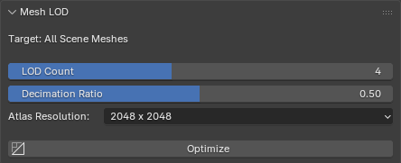

# Mesh LOD (Level of Detail)

The **Mesh LOD** module is designed to maximize your avatar's real-time performance in virtual reality and gaming environments. It automates the tedious process of generating multiple detail levels and consolidates all your materials into a single, highly optimized PBR texture atlas.

## Core Features

* **Automated Decimation:** Intelligently reduces the polygon count of your avatar across multiple tiers while preserving the silhouette and UV boundaries.
* **Material Consolidation (Baking):** Iterates over all the meshes and bakes their multiple materials into a single Unified Texture Atlas. This drastically reduces rendering draw calls.
* **Seamless Engine Integration:** The generated LOD groups (e.g., `LOD0`, `LOD1`, `LOD2`) are structured logically, making them ready to be auto-recognized by Unity's LOD Group component or Unreal Engine's static mesh pipeline.

## Interface & Controls

In the **Mesh LOD Panel**, you can configure the exact parameters for the optimization process:

* **LOD Count:** A slider defining the total number of detail levels to generate. For example, a value of `4` will generate LOD0 (original) through LOD3.
* **Decimation Ratio:** Controls the aggressiveness of the polygon reduction between each LOD step. A ratio of `0.50` means each subsequent LOD will have 50% fewer polygons than the previous one.
* **Atlas Resolution:** A dropdown to select the target dimensions for the baked PBR texture atlas (e.g., `2048 x 2048` or `4096 x 4096`).
* **Optimize Button:** Executes the baking and decimation pipeline. 

## Recommended Workflow

1. Ensure your avatar setup (from the previous module) is complete and the meshes are correctly bound to the armature.
2. Open the **Mesh LOD** panel in the QXR tab.
3. Select your desired LOD Count and Atlas Resolution. If your target platform is mobile standalone VR (like Meta Quest), `2048 x 2048` is highly recommended.
4. Click **Optimize**.

> **Performance Warning:** Texture baking is a computationally expensive process. Depending on the complexity of your materials, the atlas resolution, and your CPU/GPU hardware, the Blender interface may freeze for several minutes while the operation completes. This is completely normal behavior.