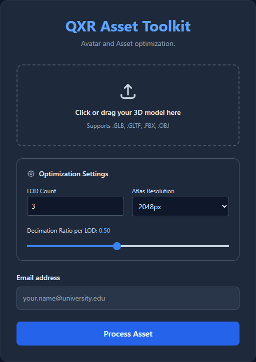
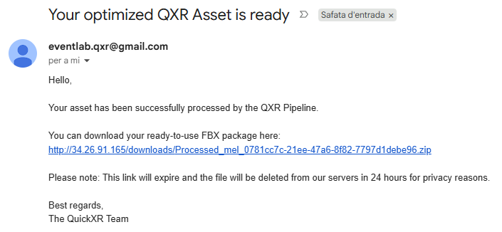
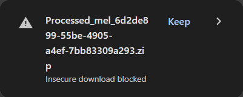

# Automated Pipeline: Cloud Service

The Cloud version of the QXR Asset Toolkit is a web-based, fire-and-forget solution. It processes various 3D file formats (including `.glb`, `.gltf`, `.fbx`, and `.obj`) asynchronously without requiring local software installations.

## Web Interface & Workflow

To run the QXR Asset Toolkit via the web, navigate to the following server address (a dedicated domain is pending, so we currently use the direct IP):

**[http://34.26.91.165/](http://34.26.91.165/)**

Upon entering the site, you will see the main interface as shown below:

To process an asset, follow this straightforward procedure:

1. **Upload your file:** Drag and drop your 3D asset into the upload zone. 
2. **Adjust Optimization Settings:** Tweak the generation parameters to fit your project's needs:
    * **LOD Count:** The number of detail levels to generate.
    * **Atlas Resolution:** The final PBR texture size (e.g., 2048px).
    * **Decimation Ratio:** The polygon reduction aggressiveness per LOD level.
3. **Enter a valid email:** Provide the email address where you want to receive the secure download link once the asset is successfully processed.
4. **Process Asset:** Click the "Process Asset" button to execute the fire-and-forget process. The server will queue the task, and you can safely close the window while the backend does the heavy lifting.

## Notifications

Once the server finishes the pipeline, you will receive an automated email containing a download link for your production-ready `.fbx` package.

### Troubleshooting Downloads (HTTP Warning)

Currently, the server is running on a standard HTTP connection while the domain and HTTPS certificates are being configured. Because of this, modern web browsers enforce strict security policies that may completely block the download if you click the link directly from your email client.

If clicking the download link does nothing or the file is blocked completely, follow this workaround:

1. **Copy the Link:** Right-click the download link in your email and select **Copy link address**.
2. **Open a New Tab:** Open a completely new window or tab in your web browser.
3. **Paste and Go:** Paste the copied link directly into the address bar and press Enter.
4. **Allow the Download:** The browser will now intercept the file and show a warning in the Downloads panel (usually an arrow icon in the top right corner). Click the **Keep** button next to the blocked file to allow it to save to your machine.

> **Note:** For privacy and server health, processing data is destroyed immediately, and the final ZIP file is purged after 24 hours.