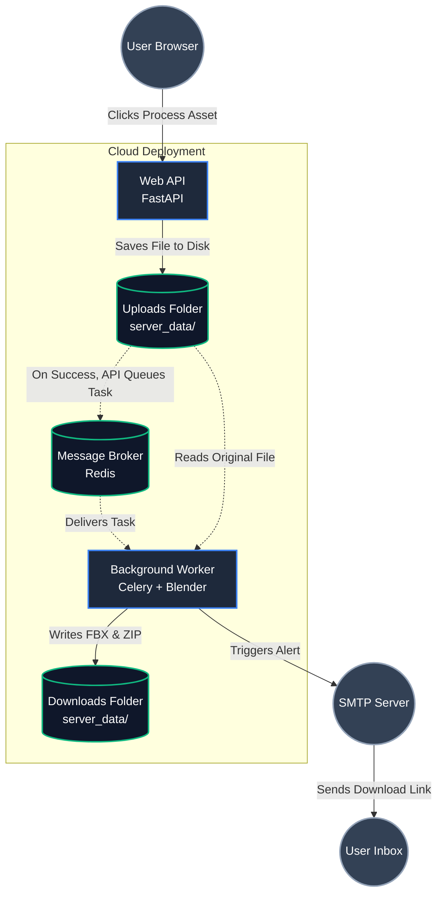

# Technical Architecture

The QXR Asset Toolkit is built on a highly scalable, decoupled microservices architecture. The cloud deployment runs on a containerized environment managed by **Docker Compose**, separating the web interface from the heavy 3D processing algorithms.

## Microservices Breakdown

The system is divided into three isolated Docker containers working in tandem to ensure the server remains responsive during high-demand computations:

* **Web API (FastAPI):** Acts as the public-facing gateway. It serves the user interface, handles secure file uploads, validates 3D formats, and writes incoming assets to the local storage. Once validated, it pushes a task to the queue and immediately returns a response to the user.
* **Message Broker (Redis):** Serves as the central communication bridge. It manages the asynchronous task queue in memory, ensuring that no processing requests are lost or dropped if multiple users upload assets simultaneously.
* **Background Worker (Celery + Blender):** The core processing muscle of the pipeline. It constantly polls the Redis queue. When a task arrives, it triggers a Blender headless instance, executing the internal QXR logic (LOD generation, PBR baking, and T-Pose enforcement) without any graphical overhead.

## Shared Data Strategy

To maintain state and share files across isolated containers, the architecture utilizes a centralized `server_data` directory mapped as a Docker volume.

* **Uploads Directory:** The Web API container saves the raw user models (`.glb`, `.gltf`, `.fbx`, `.obj`) here.
* **Downloads Directory:** Once the Background Worker finishes processing, it writes the final optimized `.fbx` and `.zip` packages here. The Web API then accesses this directory to serve the secure download links sent via the automated email system.

> **Data Retention Policy:** To ensure optimal storage management and prevent server saturation, the QXR Asset Toolkit enforces a strict 24-hour lifecycle for all files. Both the raw uploads and the processed output packages are automatically purged from the volume 24 hours after creation. Consequently, the secure download links provided to users expire permanently after this period.

## Error Recovery & Logging

If a process fails (e.g., a corrupted uploaded mesh), the Worker intercepts the exit code and captures the complete `stdout` and `stderr` logs from the Blender headless environment. These logs are immediately forwarded to the QXR technical team via SMTP, while the user receives a friendly failure notification.